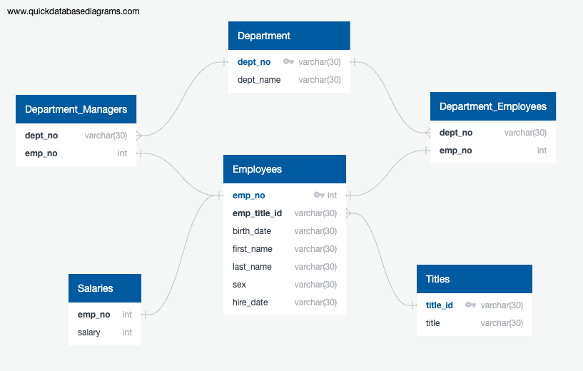
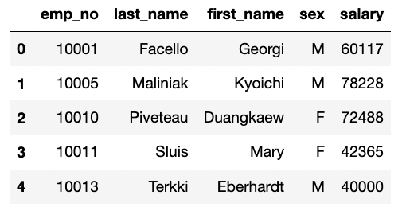
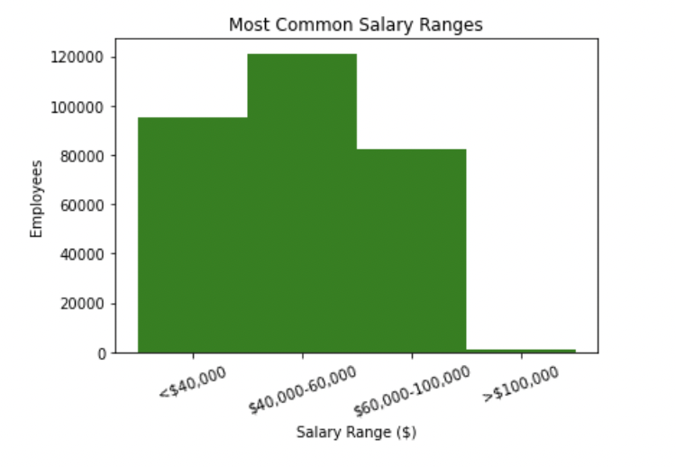
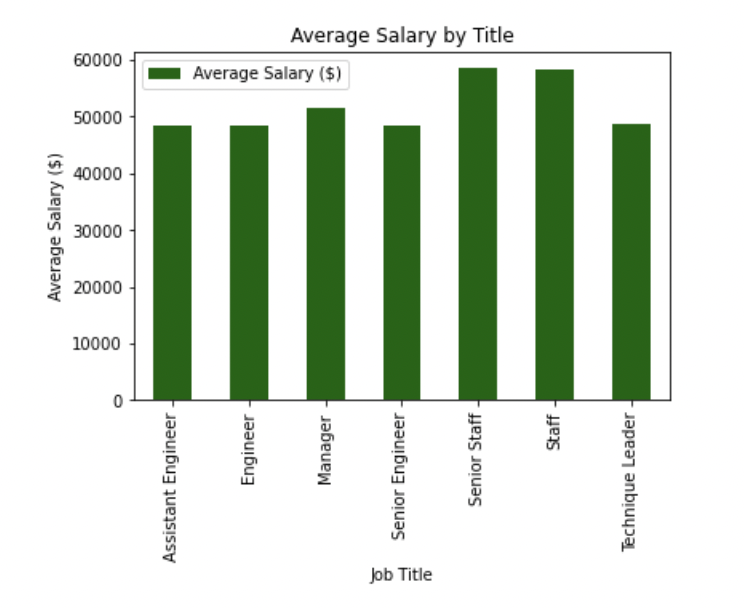

## Employee Data Inquiry

Analyzes Employee Data using SQL and SQLAlchemy Queries

## Objectives

### Step 1 - Data Modeling

* Create an Entity Relationship Diagram using https://www.quickdatabasediagrams.com/

### Step 2 - Data Engineering

* Create a table schema for each of the six CSV files
    * Specify the data types, primary keys, foreign keys, and other constraints

[Table Schema](EmployeeSQL/Queries/Employee_Table_Scemata.sql).

### Step 3 - Data Analysis

*  Analyze data using a list of queries about the data utilizing select statements and joins

[Data Queries](EmployeeSQL/Queries/Employee_Queries.sql).

### Step 4 - Data Visualization 

* Import the SQL database into Pandas

* Create a bar chart to visualize the most common salary ranges for employees

* Create a bar chart of average salary by title

---------------------------------------------------

<b>Contact:</b> bronwynmilne64@gmail.com
